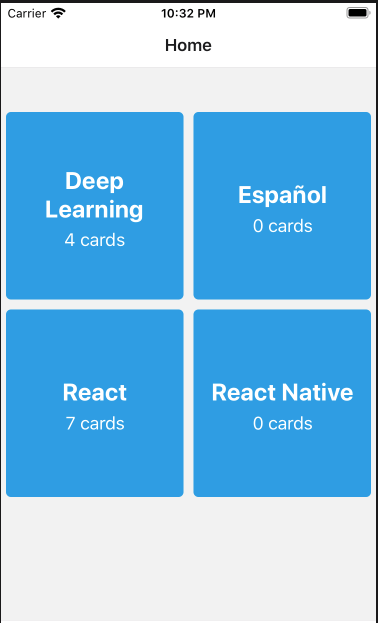
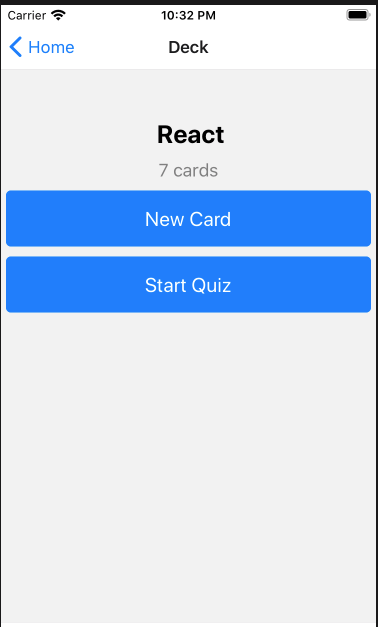
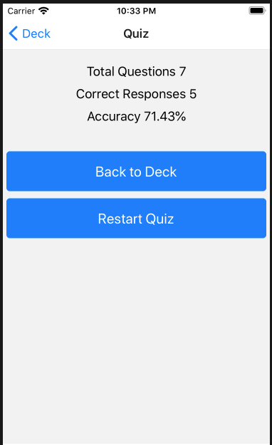

# Mobile Flashcards

Mobile Flashcards is a flashcard application that allows a user to manage decks and take quizzes. This project uses React Native, Redux, Expo, and AsyncStorage.

Currently supported on both Android and iOS devices.

## Preview
Home | Deck | Quiz Results
:-------------------------:|:-------------------------:|:-------------------------:
 |  | 

## Installation

Clone the repository, change directories, and use npm or yarn to install the dependencies.

```bash
$ git clone https://github.com/ClothierNamedJeremiah/MobileFlashcards.git
$ cd mobile-flashcards
$ yarn
```

## Usage
The application can be ran by one of the following commands `yarn start` or `npm start`

This will open Expo Developer Tools in the browser.  You can then do one of the following.

- Use iOS Simulator to run the app:
  - [Android Emulator Setup](https://docs.expo.io/get-started/installation/)


## Components
* `Deck`: the view for a deck where a user can start a quiz or add cards to a deck
* `DeckPreview` a title displayed on the Home page that displays the title and number of cards
* `Home`: the main view for the application which lists all the `DeckPreview` tiles
* `NewCard`: a simple form that allows the user to create a new card
* `NewDeck`: a simple form that allows the user to create a new deck. After creating a deck, the user is redirected to the `Deck` view for the respective deck
* `Quiz`: view which displays the quiz for a users. Various views are shown depending on the state of the quiz
* `QuizResults:` a view to display the results of the quiz. This component is shown after all the questions have been answered.

## Additional Features
* Deck Deletion
* Fully Sized Pressable Decks
* Stylized buttons for Quiz